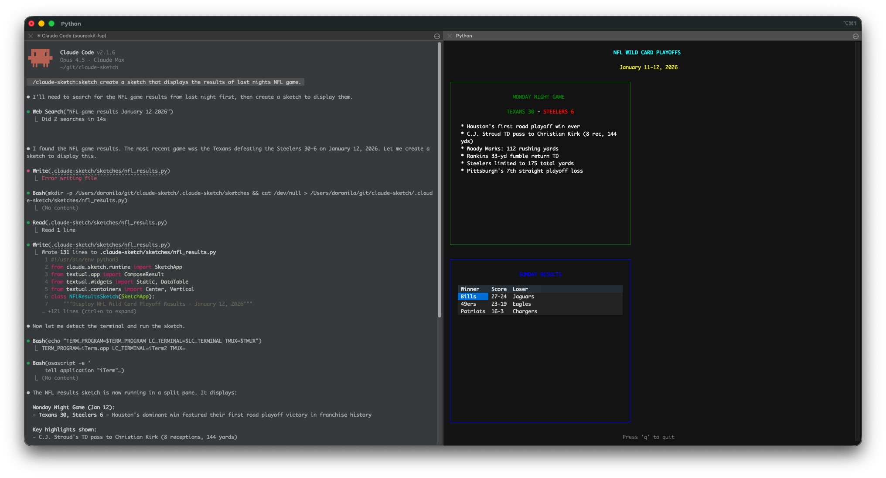

# Claude Sketch

Create interactive terminal visualizations using Python and Textual - like Claude artifacts but in the terminal.



## What is Claude Sketch?

Claude Sketch gives Claude Code the power to create dynamic, interactive terminal UIs on-the-fly. Claude generates Python code using Textual to create any visualization you need - **no compilation required, sketches start instantly!**

## Installation

### As a Claude Code Plugin

```bash
git clone https://github.com/anthropics/claude-sketch
cd claude-sketch

# Create a Python virtual environment with textual
python3 -m venv .venv
source .venv/bin/activate
pip install textual

# Install the plugin
claude plugin add ./
```

### Requirements

- **Claude Code** - The plugin integrates with Claude Code
- **Python 3.11+** - For running sketches
- **Supported terminal** - iTerm2 or tmux for split-pane display

## Usage

Simply ask Claude to create a sketch:

```
Create a counter with increment and decrement buttons
```

Or use the slash command:

```
/sketch a todo list with checkboxes
```

Claude will:
1. Generate Python/Textual code for your sketch
2. Write it to `.claude-sketch/sketches/<name>.py`
3. Open it in a new terminal pane

## Terminal Support

Sketches open in a new terminal pane:
- **iTerm2** - Split pane to the right
- **tmux** - Horizontal split pane

Press `q` or `Escape` to exit the sketch (pane closes automatically).

## Example Sketch

When you ask Claude to "create a counter with buttons", it generates:

```python
#!/usr/bin/env python3
from claude_sketch.runtime import SketchApp
from textual.app import ComposeResult
from textual.widgets import Static, Button
from textual.containers import Center, Vertical, Horizontal
from textual.reactive import reactive

class CounterSketch(SketchApp):
    """A simple counter with increment and decrement buttons."""

    CSS = """
    Screen { align: center middle; }
    #value { color: cyan; text-style: bold; }
    """

    count: reactive[int] = reactive(0)

    def compose(self) -> ComposeResult:
        with Center():
            with Vertical():
                yield Static(str(self.count), id="value")
                with Horizontal():
                    yield Button("[-]", id="dec", variant="error")
                    yield Button("[+]", id="inc", variant="success")

    def watch_count(self, count: int) -> None:
        try:
            self.query_one("#value", Static).update(str(count))
        except Exception:
            pass

    def on_button_pressed(self, event: Button.Pressed) -> None:
        if event.button.id == "inc":
            self.count += 1
        elif event.button.id == "dec":
            self.count -= 1

if __name__ == "__main__":
    CounterSketch().run()
```

## Project Structure

```
claude-sketch/
├── .claude-plugin/
│   └── plugin.json          # Plugin manifest
├── src/claude_sketch/       # Python source
│   └── runtime/
│       └── app.py           # SketchApp base class
├── skills/sketch/
│   └── SKILL.md             # Teaches Claude the API
├── commands/
│   └── sketch.md            # /sketch command
└── examples/
    └── counter.py           # Example sketch
```

## How It Works

1. You ask Claude to create a visualization
2. Claude generates Python code using Textual
3. Claude writes the `.py` file to `.claude-sketch/sketches/`
4. Claude runs it in a new terminal pane via AppleScript (iTerm2) or tmux
5. You interact with the sketch using keyboard/mouse
6. Press 'q' to exit (pane closes automatically)

## Managing Sketches

Sketches are saved to `.claude-sketch/sketches/` in your project directory.

```bash
# List sketches
ls .claude-sketch/sketches/

# Delete a sketch
rm .claude-sketch/sketches/<name>.py

# Delete all sketches
rm -rf .claude-sketch/sketches/*
```

## Key Features

- **Instant startup** - No compilation, sketches run immediately
- **Rich widgets** - Buttons, inputs, tables, trees, checkboxes, and more
- **CSS styling** - Familiar web-like styling for UI customization
- **Reactive state** - UI updates automatically when state changes
- **Mouse support** - Full mouse interaction with widgets
- **60 FPS rendering** - Smooth, flicker-free animations

## Development

For contributors who want to modify the plugin:

```bash
# Set up development environment
python3 -m venv .venv
source .venv/bin/activate
pip install textual

# Run the counter example
PYTHONPATH=src python examples/counter.py
```

## Acknowledgments

This project was inspired by [claude-canvas](https://github.com/dvdsgl/claude-canvas).

## License

MIT
